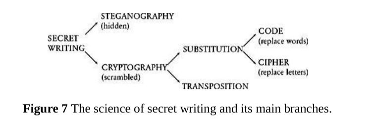

# The Code Book: The Science of Secrecy from Ancient Egypt to Quantum Cryptography

- The book talks about the classification of secret communication in the way: 

  Examples:
  - Steganography: Greek words steganos, meaning “covered,” and graphein, meaning “to write.”
    - The ancient Chinese wrote messages on fine silk, which was then scrunched into a tiny ball and covered in wax. The messenger would then swallow the ball of wax. 
	- the microdot is a form of steganography that became popular during the Second World War. German agents in Latin America would photographically shrink a page of text down to a dot less than 1 millimeter in diameter, and then hide this microdot on top of a full stop in an apparently innocuous letter. The first microdot to be spotted by the FBI was in 1941, following a tip-off that the Americans should look for a tiny gleam from the surface of a letter, indicative of smooth film.
	- The sender writes the message along the length of the scytale, and then unwinds the strip, which now appears to carry a list of meaningless letters. The message has been scrambled. The messenger would take the leather strip, and, as a steganographic twist, he would sometimes disguise it as a belt with the letters hidden on the inside. To recover the message, the receiver simply wraps the leather strip around a scytale of the same diameter as the one used by the sender.
    - Histaiaeus shaved the head of his messenger, wrote the message on his scalp, and then waited for the hair to regrow. This was clearly a period of history that tolerated a certain lack of urgency. The messenger, apparently carrying nothing contentious, could travel without being harassed. Upon arriving at his destination he then shaved his head and pointed it at the intended recipient.

  - Substitution cryptography:
    - Substitution cipher used by Julius Caesar. He simply replaced each letter in the message with the letter that is three places further down the alphabet. It is clear that the cipher alphabet has been shifted by three places, and hence this form of substitution is often called the Caesar shift cipher, or simply the Caesar cipher. Although Suetonius mentions only a Caesar shift of three places, it is clear that by using any shift between 1 and 25 places it is possible to generate 25 distinct ciphers. I
    - Syntax:  The convention in cryptography is to write the plain alphabet in lower-case letters, and the cipher alphabet in capitals. Similarly, the original message, the plaintext, is written in lower case, and the encrypted message, the ciphertext, is written in capitals.

- Terminology:

  - cipher/ciphertext: encrypted text
  - Greek word kryptos, meaning “hidden.” The aim of cryptography is not to hide the existence of a message, but rather to hide its meaning, a process known as encryption.
