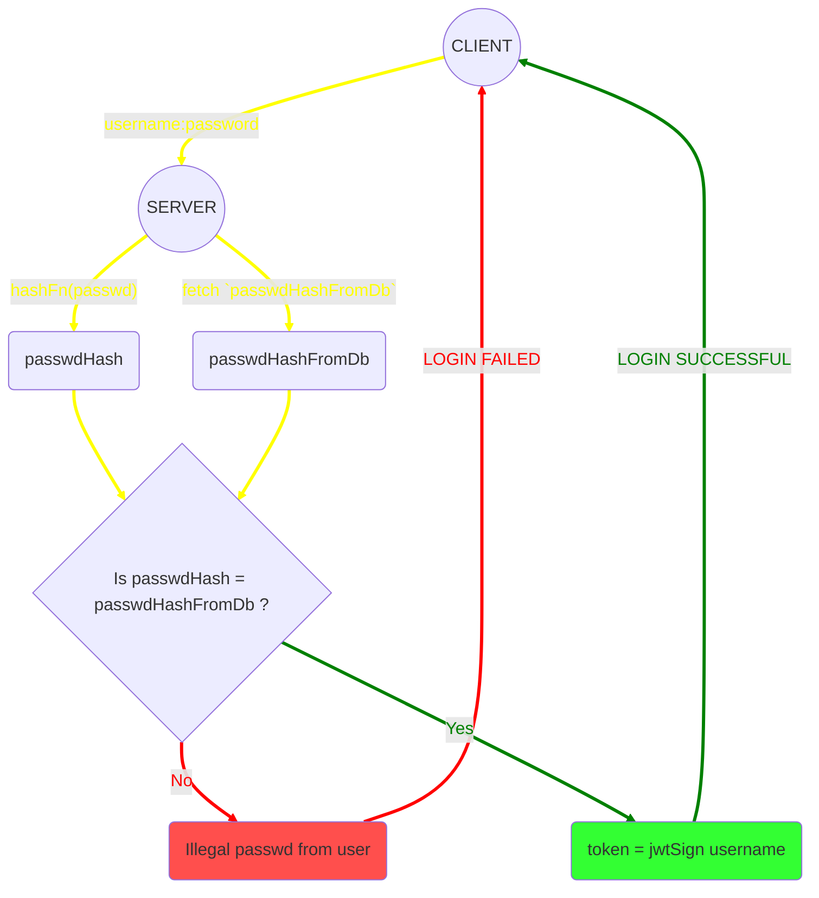
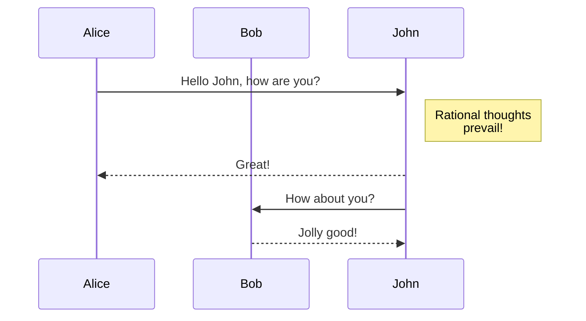

# Login and Signup processes

**Below flowchart shows login process-**

*FYI: You can view the code of above diagram by clicking on the* **Raw** *button above.*

## Why `mermaidjs` ?

Ans. Making diagrams with code is like don't give a fuck about design but logic flow.

### Using mermaid
- Flow chart docs: https://mermaid-js.github.io/mermaid/#/flowchart
- Mermaid is supported in github, yo!
- Mermaid Docs: [https://mermaid-js.github.io/mermaid/#/](https://mermaid-js.github.io/mermaid/#/)
- **Live Mermaid:** [https://mermaid.live/](https://mermaid.live/)
- Mermaid is supported at markdown files in github (not in github pages yet) and gist also supports mermaid as well.

Here is a simple flow chart:

