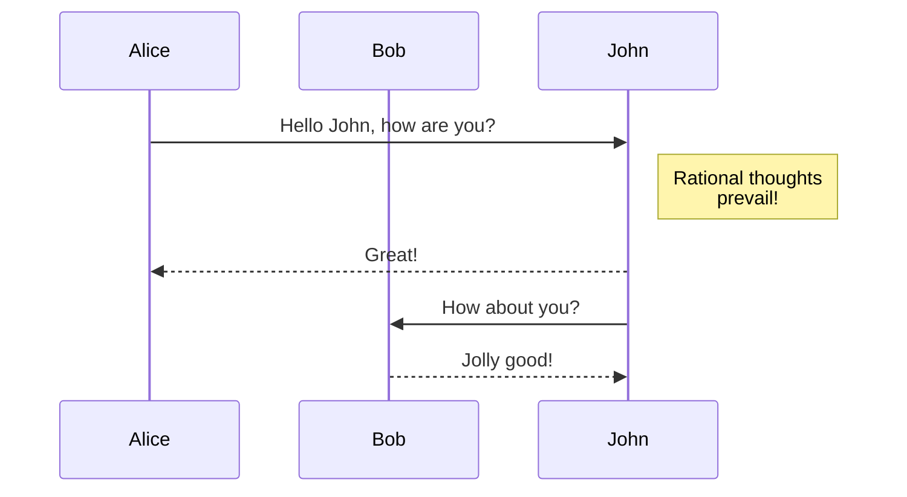

# Login flow in any app

## Using mermaid
- Mermaid is supported in github, yo!
- Mermaid Docs: [https://mermaid-js.github.io/mermaid/#/](https://mermaid-js.github.io/mermaid/#/)
- Live Mermaid: [https://mermaid.live/](https://mermaid.live/)

Here is a simple flow chart:

