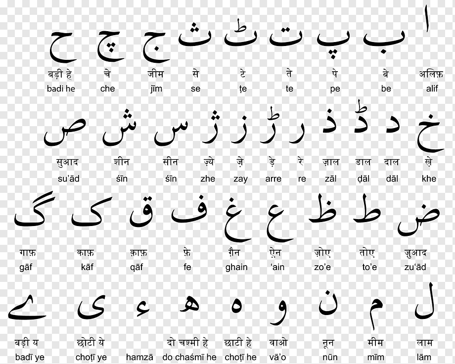

# Learn urdu

Each letter has three other forms as well i.e., initial, medial and final forms in urdu. Other forms of each letter can be identified easily by looking at the number of dots above or below the letter or through the stylistic pointers.

- [Video 1](https://youtu.be/Dw9M6PUgnFQ?t=71)
- [Video 2](https://youtu.be/MtotCX_0Nh0)
- 
