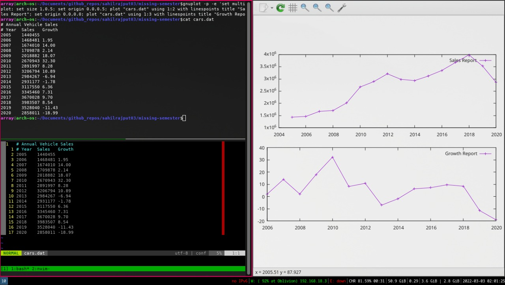

# Learn gnu-plot

why ? Ans. Just like that.



You can use plot and splot keywordw in gnuplot shell. `plot` and `splot` are the primary commands in Gnuplot. They plot functions
and data in many many ways. plot is used to plot 2-d functions and data,
while splot plots 3-d surfaces and data.

```txt
Syntax:
       plot {[ranges]}
            {[function] | {"[datafile]" {datafile-modifiers}}}
            {axes [axes] } { [title-spec] } {with [style] }
            {, {definitions,} [function] ...}

where either a [function] or the name of a data file enclosed in quotes
is supplied. For more complete descriptions, type: help plot help plot
with help plot using or help plot smooth .
```

```bash
# Documentation: https://people.duke.edu/~hpgavin/gnuplot.html
# Quick reference pdf (LGTM): http://www.gnuplot.info/docs_4.0/gpcard.pdf


# Run commands directly via arguments to gnuplot, -p option means
persists graph window, -e allows to pass command list.
gnuplot -p -e 'plot sin(x)'
# BAD THING ABOUT ^^^ THIS WAY IS YOU GET NEW WINDOW EACH TIME YOU EXECUTE ABOVE
# COMMAND SO IT ISN'T GOOD FOR TESTING BASIS. ~SAHIL

# MORE:: Using set command inclusively with gnuplot cli:
gnuplot -p -e 'set boxwidth 0.5; plot sin(x)'

# My quick example:
gnuplot -p -e 'plot "cars.dat" with linespoints'
gnuplot -p -e 'plot "cars.dat" using 1:2 with linespoints, "cars.dat" using 1:3 with linespoints'
# Generated graph from below command is in the end of the page
gnuplot -p -e 'set multiplot; set size 1,0.5; set origin 0.0,0.5; plot "cars.dat" using 1:2 with linespoints title "Sales Report"; set origin 0.0,0.0; plot "cars.dat" using 1:3 with linespoints title "Growth Report"; unset multiplot'
# ^^^^^^^  I am generating two graphs in completely different, you can print
# multiple graphs on the very same axis by simpy putting separating all
# plot command by a comma (,)


# Launches a gnuplot shell ( AMAZING FOR TESTING- IMO SAHIL):
gnuplot


# You can execute any general shell command in gnuplot shell as well by
prefixing that with !, for e.g, below will list directory listings:
!ls


#Plots x from -10 to +10, and y from  -1 to +1
plot sin(x)

# Plots x from -10 to +10, and y from -30 to +30
plot tan(x)

# Plots x from -10 to +10, and y from -30 to +30
# Also puts the title for each graph in top right.
plot sin(x) title 'My Sine function', tan(x) title 'My Tangent graph'

# Plots same above graph but labeling is like sin(x) and tan(x) only
plot sin(x), tan(x)

# clears current the graph
clear


################### EXAMPLE FROM DOCS
plot "force.dat" using 1:2 title 'Column', "force.dat" u 1:3 t 'Beam'
# Note that the words: using , title , and with can be abbreviated as:
# u , t , and w . Also, each line and point style has an associated
# number.


################### E.G. FROM DOCS
plot "force.dat" using 1:2 title 'Column', "force.dat" u 1:3 t 'Beam'


### TIP: Sahil
# Use ctrl+l to clear the command history (don't use clear as it clears
# the graph and not the command history).


################### E.G. FROM DOCS
plot "force.dat" using 1:2 title 'Column' with lines, "force.dat" u 1:3 t 'Beam' w linespoints
## UNDERSTANDING:
## Plots may be displayed in one of eight styles:
## lines
## points,
## linespoints (#####LGTM ~sahil)
## impulses
## dots
## steps
## fsteps
## histeps
## errorbars,
## xerrorbars
## yerrorbars
## xyerrorbars
## boxes (#########LGTM ~sahil, plots histograms, yo!)
## boxerrorbars
## boxxyerrorbars
## financebars
## candlesticks
## vector


###### ~sahil: plots as points for using column1 and column2 only.
plot 'force.dat'


# You can replot to replot data(say you modified some data in file or
used any set commands as explained below)
replot


##### from docs #### 4.2 set command customization

Customization of the axis ranges, axis labels, and plot title, as well as many other features, are specified using the set command. Specific examples of the set command follow. (The numerical values used in these examples are arbitrary.) To view your changes type: replot at the gnuplot> prompt at any time.

      Create a title:                  > set title "Force-Deflection Data"
      Put a label on the x-axis:       > set xlabel "Deflection (meters)"
      Put a label on the y-axis:       > set ylabel "Force (kN)"
      Change the x-axis range:         > set xrange [0.001:0.005]
      Change the y-axis range:         > set yrange [20:500]
      Have Gnuplot determine ranges:   > set autoscale
      Move the key:                    > set key 0.01,100
      Delete the key:                  > unset key
      Put a label on the plot:         > set label "yield point" at 0.003, 260
      Remove all labels:               > unset label
      Plot using log-axes:             > set logscale
      Plot using log-axes on y-axis:   > unset logscale; set logscale y
      Change the tic-marks:            > set xtics (0.002,0.004,0.006,0.008)
      Return to the default tics:      > unset xtics; set xtics auto
Other features which may be customized using the set command are: arrow, border, clip, contour, grid, mapping, polar, surface, time, view, and many more. The best way to learn is by reading the on-line help information, trying the command, and reading the Gnuplot manual. You may also post questions to the newsgroup comp.graphics.apps.gnuplot


##### ~Sahil: My practise notes ####


# Say anytime you baffle with the scaling in the graph, say you scrolled
# in the graph and its not aligned as it was, then you can use:
set autoscale
replot
# ^^ this will actually take the scaling by gnuplot take into effect.

# TIP: you can use two commands in one line as well:
set autoscale; replot


# Put a label on the plot:
set label "yield point" at 0.003, 260; replot
# FYI: ~Sahil: The label text is placed like bottom-left corner is
# aligned at the point we give it to.

# To remove labels:
unset label; replot


#### To set x axis meter scale marks use:
set xtics (0.002,0.004,0.006,0.008, 0.001); replot

#### To remove them, simply use:
unset xtics; set xtics auto; replot


####### FROM DOCS ### 5. PLOTTING DATA FILES WITH OTHER COMMENT CHARACTERS

# If your data file has a comment character other than # you can tell
# Gnuplot about it. For example, if your data file has "%" comment
# characters (for Matlab compatability), typing

#       gnuplot>  set datafile commentschars "#%"
# indicates that either a "#" or a "%" character starts a comment.


######### FROM DOCS ### 6. GNUPLOT SCRIPTS

# Sometimes, several commands are typed to create a particular plot, and it is easy to make a typographical error when entering a command. To stream- line your plotting operations, several Gnuplot commands may be combined into a single script file. For example, the following file will create a customized display of the force-deflection data:

      # Gnuplot script file for plotting data in file "force.dat"
      # This file is called   force.p
      set   autoscale                        # scale axes automatically
      unset log                              # remove any log-scaling
      unset label                            # remove any previous labels
      set xtic auto                          # set xtics automatically
      set ytic auto                          # set ytics automatically
      set title "Force Deflection Data for a Beam and a Column"
      set xlabel "Deflection (meters)"
      set ylabel "Force (kN)"
      set key 0.01,100
      set label "Yield Point" at 0.003,260
      set arrow from 0.0028,250 to 0.003,280
      set xr [0.0:0.022]
      set yr [0:325]
      plot    "force.dat" using 1:2 title 'Column' with linespoints , \
            "force.dat" using 1:3 title 'Beam' with points
# Then the total plot can be generated with the command
gnuplot> load 'force.p'; replot
#   ^^^^ that says that you need to execute load command from the
# subshell of gnuplot only

# ALERT: Using set key, yr and xr options are not working and throws
# error if used accordingly from docs, so i commented those and used below
# force.p file instead:

#### FILLE: force.p ######
# Gnuplot script file for plotting data in file "force.dat"
# This file is called   force.p
set   autoscale                        # scale axes automatically
unset log                              # remove any log-scaling
unset label                            # remove any previous labels
set xtic auto                          # set xtics automatically
set ytic auto                          # set ytics automatically
set title "Force Deflection Data for a Beam and a Column"
set xlabel "Deflection (meters)"
set ylabel "Force (kN)"
set label "Yield Point" at 0.003,260
set arrow from 0.0028,250 to 0.003,280
# set key 0.01,100
# set xr 0.0:0.022
# set yr 0:325


####### FROM DOCS ### 9. MULTI-PLOT

# Gnuplot can plot more than one figure in a frame ( like subplot in matlab ) i.e., try:

      set multiplot;                          # get into multiplot mode
      set size 1,0.5;
      set origin 0.0,0.5;   plot sin(x);
      set origin 0.0,0.0;   plot cos(x)
      unset multiplot                         # exit multiplot mode


### You can checkout the demonstration files @ http://web.archive.org/web/20190409223434/http://gnuplot.sourceforge.net/demo_4.2/
# Src: on the same page with link with text: ""Gnuplot demonstration files""


```
